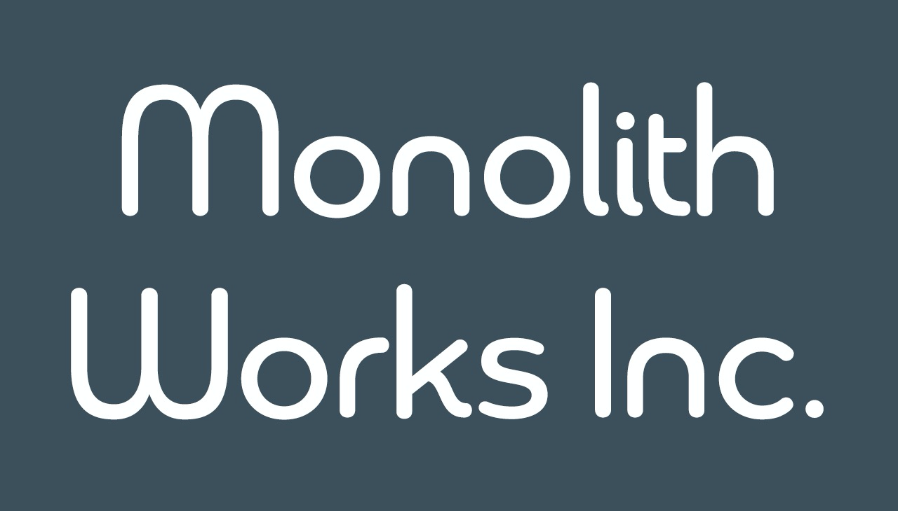

---

layout: col-sidebar
title: OWASP Saitama
tags: saitama-tag
region: Asia
country: Japan
meeting-platform: connpass

---

## ようこそ

こちらはOWASP Saitamaチャプターのページです。

OWASP Saitamaチャプターとは、サイバーセキュリティの向上を目指す非営利組織であるOWASP (The Open Web Application Security Project) のさいたま支部です。

チャプターリーダーは吉村 孝広、吉村 賢哉の2名です。

## 次回のミーティング予定

現在、イベント管理に[Connpass](https://owaspsaitama.connpass.com/)を使用しています。もし使用できない場合、チャプターリーダーまでご連絡いただくことでも参加可能です。

* 2024/10/29 19:00+9..: [OWASP Saitama MTG #22](https://owaspsaitama.connpass.com/event/331588/) (ハイブリッド; [春日部市ふれあいキューブ 4F 会議室2](https://www.kasukabehall.jp/))

## ミッション

*自由な意見交換*

当チャプターはサイバーセキュリティに関連するトピックにおける自由な意見交換が最も重要と考えます。このため当チャプターではスピーカーが明示的に許可した場合を除きトークセッションにおける一切の録音・録画・内容公開を禁止するなど、スピーカーの方々が安心してお話できるよう環境整備に努めます。

*有用な情報共有*

当チャプターは有用な情報を意味ある形で一早く共有することが重要であると考えます。このため当チャプターは抽象的な内容よりも具体的な内容を好みます。

*深い技術交流*

当チャプターは技術的な交流が重要であると考えます。このため当チャプターはワークショップも適宜開催いたします。

*楽しめる環境の提供*

当チャプターは楽しむことこそが活動の源泉であると考えます。このため当チャプターはいわゆる「ゆるい」運用を行ないます。

## OWASP Saitamaミーティング
サイバーセキュリティ向上に貢献しようという地元有志がさいたま市あるいは春日部市に集まって開く当チャプターの定例勉強会です。サイバーセキュリティに携わる幅広い分野の方をスピーカーとしてお呼びして開催します。職種・経験・年齢・性別・国籍などは一切問いません。どなたでもご参加ください。

※当チャプターではスピーカーが明示的に許可した場合を除き、トークセッションの録音・録画・内容公開は原則禁止とさせていただきます

イベント開催等のアナウンスは[チャプターページ](#次回のミーティング予定)で行ないます。また以下のようなプラットフォームへも配信します。

* [Connpass](https://owaspsaitama.connpass.com/)
* [Facebook](https://www.facebook.com/owaspsaitama)
* [Twitter](https://twitter.com/OWASP_Saitama)

## スピーカーとして参加を希望される方へ

OWASP Saitamaミーティングにスピーカーとして参加を希望される方は、[speaker agreement](/www-policy/legal/speaker-agreement)をご覧の上、以下の内容をチャプターリーダーまでご連絡ください。

 * お名前
 * セッションタイトル

## 協賛企業・団体

以下は当チャプターに協賛をいただいている企業様・団体様の一覧です。

&emsp;
